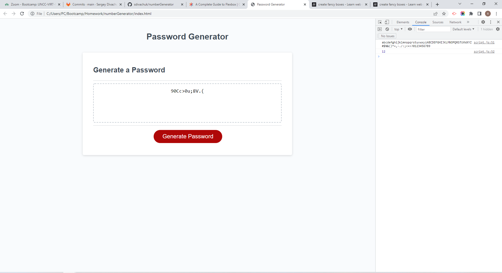

# numberGenerator

## Table of Contents
- [Description](#description)
- [Visuals](#Visuals)
- [Resources](#Resources)

## Description

Objective is to create a password generator that takes imput from user and prints out random password.

Started by creating prompt and confirms so that user inputs number of characters desired, if they want to use
lowercase letters, uppercase letters, symbols, or special characters. 

Made sure user input number between 8 and 128 or they get a message telling them to choose a number in that range.

Also made sure user chose at least one option or they got message telling them they need to choose at least one character type.

## Visuals

## Resources
- [Live Site](https://sdivachuk.github.io/numberGenerator/)
- [Repository](https://github.com/sdivachuk/numberGenerator)
